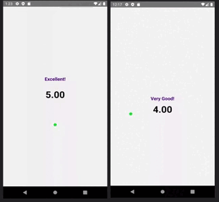

# React Native Segment ProgressBar

Segment ProgressBar for React Native, works on both **iOS** and **Android**. 
Check out our documentation below to learn how to get started.

## Demo and Docs
  Idea & base code adapted from <a href="https://github.com/shipt/segmented-arc-for-react-native" target="_blank">https://github.com/shipt/segmented-arc-for-react-native</a>

## Example Image



## Contents

- [Installation](#-installation)
- [Usage](#-usage)
- [Props](#-props)

## 🚀 Installation

1. Install `react-native-segment-progress-bar`

2. Install `react-native-svg` library for Dependency

```bash
yarn add react-native-segment-progress-bar
```

```bash
npm install react-native-segment-progress-bar
```

## 🎉 Usage

Here is a basic example of how to use this component. It covers all the main features.

```js
import React, { useState } from 'react';
import { View, Text, Pressable } from 'react-native';
import { ArcProgressBar } from 'react-native-segment-progress-bar';

const App = () => {
  const [showArcRanges, setShowArcRanges] = useState(false);

  const segments = [
    {
      scale: 0.25,
      filledColor: '#C70039',
      emptyColor: '#F2F3F5',
      data: { label: 'Not bad!' }
    },
    {
      scale: 0.25,
      filledColor: '#404FCD',
      emptyColor: '#F2F3F5',
      data: { label: 'Good!' }
    },
    {
      scale: 0.25,
      filledColor: '#EBD22F',
      emptyColor: '#F2F3F5',
      data: { label: 'Very Good!' }
    },
    {
      scale: 0.25,
      filledColor: '#44CD40',
      emptyColor: '#F2F3F5',
      data: { label: 'Excellent!' }
    }
  ];

  const ranges = ['10%', '20%', '30%', '40%', '50%'];

  const _handlePress = () => {
    setShowArcRanges(!showArcRanges);
  };

  return (
    <View style={{ flex: 1, alignItems: 'center', justifyContent: 'center' }}>
      <ArcProgressBar
        segments={segments}
        fillValue={70}
        isAnimated={true}
        animationDelay={1000}
        showArcRanges={showArcRanges}
        ranges={ranges}
      >
        {data => (
          <Pressable onPress={_handlePress} style={{ alignItems: 'center' }}>
            <Text style={{ fontSize: 16, paddingTop: 16 }}>{data.lastFilledSegment.data.label}</Text>
            <Text style={{ lineHeight: 80, fontSize: 24 }}>More info</Text>
          </Pressable>
        )}
      </ArcProgressBar>
    </View>
  );
};

export default App;
```


# 📖 Props

| Name                        | Type                                                                              | Default          | Description                                                                                                                                                                                                                                                       |
| --------------------------- | --------------------------------------------------------------------------------- | ---------------- | ----------------------------------------------------------------------------------------------------------------------------------------------------------------------------------------------------------------------------------------------------------------- |
| fillValue                   | number (0-100)                                                                    | 0                | Current progress value                                                                                                                                                                                                                                            |
| segments                    | Array of { scale: number, filledColor: string, emptyColor: string, data: object } | []               | Segments of the arc. Here, scale is a percentage value out of 100%, filledColor for filled part of a segment, and emptyColor is background color for an empty segment, data could be any object that you'd want to receive back for a segment. See example above. |
| filledArcWidth              | number                                                                            | 8                | Thickness of progress line                                                                                                                                                                                                                                        |
| emptyArcWidth               | number                                                                            | 8                | Thickness of background line                                                                                                                                                                                                                                      |
| spaceBetweenSegments        | number                                                                            | 2                | Space between segments                                                                                                                                                                                                                                            |
| arcDegree                   | number                                                                            | 180              | Degree of arc                                                                                                                                                                                                                                                     |
| radius                      | number                                                                            | 100              | Arc radius                                                                                                                                                                                                                                                        |
| isAnimated                  | bool                                                                              | true             | Enable/disable progress animation                                                                                                                                                                                                                                 |
| animationDuration           | number                                                                            | 1000             | Progress animation duration                                                                                                                                                                                                                                       |
| animationDelay              | number                                                                            | 0                | Progress animation delay                                                                                                                                                                                                                                          |
| ranges                      | Array of strings                                                                  | []               | Arc ranges (segments) display values                                                                                                                                                                                                                              |
| rangesTextColor             | string                                                                            | '#000000'        | Color of ranges text                                                                                                                                                                                                                                              |
| rangesTextStyle             | object                                                                            | { fontSize: 12 } | Ranges text styling                                                                                                                                                                                                                                               |
| showArcRanges               | bool                                                                              | false            | Show/hide arc ranges                                                                                                                                                                                                                                              |
| middleContentContainerStyle | object                                                                            | {}               | Extra styling for the middle content container                                                                                                                                                                                                                    |
| capInnerColor               | string                                                                            | '#28E037'        | Cap's inner color                                                                                                                                                                                                                                                 |
| capOuterColor               | string                                                                            | '#FFFFFF'        | Cap's outer color                                                                                                                                                                                                                                                 |
| children                    | function                                                                          |                  | Pass a function as a child. It receives metaData with the last filled segment's data as an argument. From there you can extract data object. See example above.                                                                                                   |
|                             |

# 📄 License

MIT
